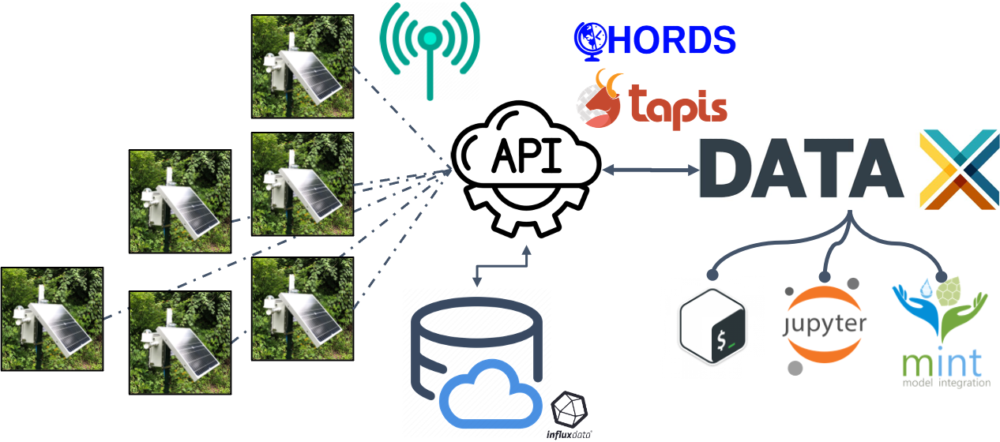
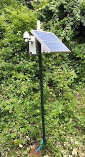

# µPSTREAM (Particle Revision)

Firmware created to collect sensor data based on the Particle Boron on the Particle Platform

# What is µPSTREAM?
µPSTREAM (pronounced up-stream) is a broad term used to describe the use of a sensor connected to a device (e.g. microcontroller, RPi) with a network connection (e.g. wifi, cellular, satellite, LoRA) through which collected data is transmitted directly to a datastore for analysis and/or model integration. 

# The Team

| Full Name | Title | Department | Email |
| ----- | ----- | ----- | ----- |
| Je’aime Powell | PI, Sensor Design & Adaptive AI Development | Texas Advanced Computing Center | jpowell@tacc.utexas.edu |
| Kelly Pierce | Data Mining /Ecological Reasoning| Texas Advanced Computing Center |kpierce@tacc.utexas.edu |
| Tim Keitt | Co-I, Professor | University of Texas at Austin Department of Integrative Biology |tkeitt@utexas.edu |

# Links
* Open Data Sets from Deployments (CHORDS) - http://pt2050dashboard-dev.tacc.utexas.edu 
* µPSTREAM Sensor Integration with DataX - https://tinyurl.com/UPSTREAM-DataX 
* Base System with Cellular Hardware Bill of Materials - https://tinyurl.com/UPSTREAM-Base-BOM 

## Code Repositories (GitHub)
* µPSTREAM-Particle Base Station - https://github.com/jeaimehp/upstream-particle 
* µSense - https://github.com/jeaimehp/microsense 
* µPSTREAMPi - https://github.com/jeaimehp/upstream-rpi 

